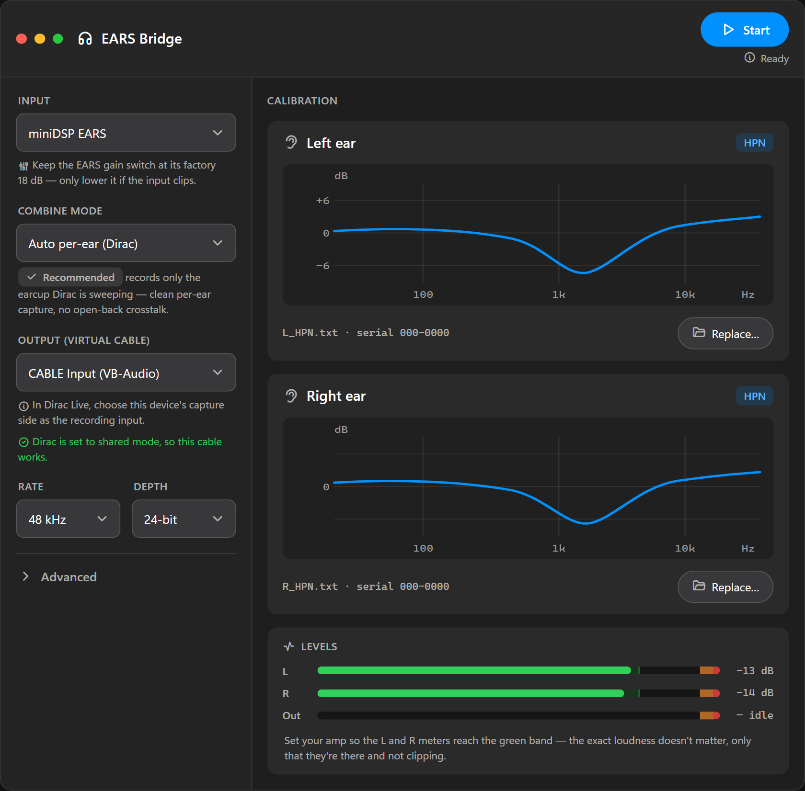
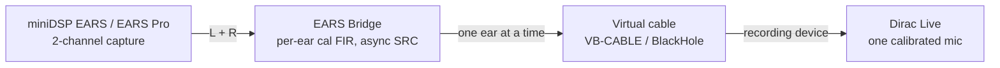
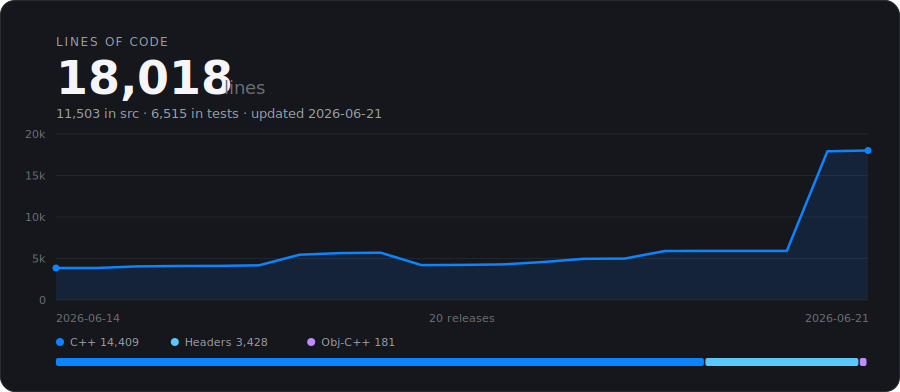

# EARS Bridge


Use a two-channel **miniDSP EARS** or **EARS Pro** headphone-measurement jig with **Dirac Live**, which only accepts a single calibrated microphone. EARS Bridge applies each ear's calibration and presents it to Dirac through a virtual audio device as the single microphone Dirac expects — in the default Auto per-ear mode it follows Dirac's sweep and sends whichever earcup is being measured, one ear at a time, never combining the two.

> [!WARNING]
> **Alpha — pre-release.** EARS Bridge is in active testing. Expect bugs and rough edges, treat measurement results as provisional, and please [report issues](https://github.com/Elevatormusic/ears-bridge/issues). Every published build is a pre-release and has only been tested with windows 11.


[](https://elevatormusic.github.io/ears-bridge/)

**Website and downloads:** [elevatormusic.github.io/ears-bridge](https://elevatormusic.github.io/ears-bridge/)

<p align="center">
  
</p>

Dirac Live expects one microphone with one calibration curve, but the EARS has two capsules, each with its own factory calibration. EARS Bridge sits between the jig and Dirac: it captures both ear channels, applies each ear's calibration as an inverse-correction FIR, and presents the result to Dirac as the single microphone it expects — in the default Auto per-ear mode it sends whichever earcup Dirac is sweeping, so each ear is measured on its own pass rather than combined. Dirac sees exactly what it expects while both capsules are accounted for.

## How it works



The capture device and the virtual output device run on independent clocks, so the path includes a lock-free, drift-correcting asynchronous sample-rate converter. During a measurement it holds a stable resample ratio across the sweep so the timebase stays consistent from sweep to sweep — that's what keeps Dirac from rejecting headphone captures as "imprecise." The correction filters are minimum-phase FIRs derived from each ear's calibration file, rebuilt off-thread whenever you change a file or the sample rate.

## Status

- **Windows** — verified: built and tested, packaged as a one-click installer. The executable is self-contained, so no Visual C++ redistributable is needed.
- **macOS** — packaged as a universal (Apple Silicon and Intel) `.dmg`, built by CI. The audio path still needs validation on real Apple hardware (see [Bench validation](#bench-validation)).

Both installers are currently unsigned, so the first launch shows a one-time security prompt — see the install steps below.

## Roadmap

EARS Bridge is in active development. A look at recent and upcoming work:

**Shipped**
- Per-ear calibration combined into the single microphone Dirac expects, with an Auto per-ear mode that follows Dirac's sweep so each earcup is measured cleanly.
- One-click Dirac shared-mode fix for the virtual cable.
- Phase-stable measurements — the chain holds a steady timebase through the sweep, so Dirac no longer flags headphone captures as "imprecise" (excluded from phase correction).
- Live measurement feedback — the input level and any clipping are shown during the sweep, and the earcup being captured is indicated, so you can fix the level on the next pass.
- Measurement-integrity safeguards — clipping, dropouts, clock drift, and mid-run format changes are detected, so a corrupted capture is never reported as clean.
- Calibration validation that checks your left/right files before a measurement starts.
- Automated build + test on Windows and macOS; releases are gated on the test suite.

**In progress**
- A signal-chain status panel — sample rate, channels, bit depth, and routing verified across the whole chain at a glance.
- Reference-based measurement quality grading — EARS Bridge captures Dirac's own sweep and deconvolves each capture against it; the per-ear grade is in the app now as informational, with the clean-vs-noisy thresholds being validated against real measurements before it gates a result.
- Per-room level calibration — measure your ambient and amp noise floor and recommend the gain settings, so the level setup is tuned to your rig.
- macOS validation on real Apple hardware.

This is alpha software, so the list will shift as we learn from real measurements.

## Requirements

### Hardware
- A miniDSP **EARS** (USB, 48 kHz / 24-bit) or **EARS Pro** (USB-C, 44.1–192 kHz, 16/24/32-bit).
- The per-ear factory calibration files for your unit (FRD text files, one per capsule).

### Software
- **Dirac Live** (the standalone measurement app) — runs the calibration sweeps and builds the correction.
- **Dirac Live Processor** — the piece that actually applies the finished correction to your audio when you listen. (Both come with a Dirac Live licence.)
- A **virtual audio device** to carry EARS Bridge's output into Dirac: [VB-CABLE](https://vb-audio.com/Cable/) on Windows, or [BlackHole 2ch](https://existential.audio/blackhole/) on macOS.

## Install

### Windows
1. Download `EARS-Bridge-<version>-Setup.exe` from the [Releases page](https://github.com/Elevatormusic/ears-bridge/releases) and run it. It installs per-user, so it needs no administrator rights.
2. Install [VB-CABLE](https://vb-audio.com/Cable/) and reboot if its installer asks.

Because the app is unsigned, Windows SmartScreen may warn about an unknown publisher on first launch. Choose **More info**, then **Run anyway**.

### macOS
1. Download `EARS-Bridge-<version>-macOS.dmg` from the [Releases page](https://github.com/Elevatormusic/ears-bridge/releases), open it, and drag **EARS Bridge** to **Applications**.
2. The app isn't notarized yet, so the first launch is blocked. To allow it **without Terminal**: double-click **EARS Bridge** in Applications and click **Done** on the "cannot be opened because Apple cannot check it for malicious software" dialog, then open **System Settings → Privacy & Security**, scroll down to the "EARS Bridge was blocked…" message, and click **Open Anyway** (confirm with your password or Touch ID). On macOS 15 (Sequoia) this replaced the old right-click → Open.

   Or strip the quarantine flag once in Terminal (no prompts), then open it normally:
   ```sh
   xattr -dr com.apple.quarantine "/Applications/EARS Bridge.app"
   ```
3. Install [BlackHole 2ch](https://existential.audio/blackhole/).

## Usage — correct your headphones from scratch

New to all of this? This is the whole process, start to finish. You'll use four things: **EARS Bridge** (this app), **VB-CABLE** (a free virtual audio cable), **Dirac Live** (measures and builds the correction), and the **Dirac Live Processor** (applies it when you listen). Install all four first — see [Install](#install).

### How the pieces fit together

Dirac corrects sound using one microphone. The EARS jig is really two microphones — one mic sealed against each earcup — and Dirac only takes one. EARS Bridge sits in the middle: it captures both earcups, applies each one's factory calibration, and hands Dirac whichever earcup is being swept, through the virtual cable, as the single mic Dirac expects.

```
Headphone amp  ──►  Headphones on the EARS jig  ──►  EARS Bridge  ──►  VB-CABLE  ──►  Dirac Live
  (plays the sweep)        (two earcup mics)        (per-ear cal)   (virtual mic)  (records + builds the filter)
```

**Everything in that chain must run at 48 kHz.** A single device left at 44.1 kHz silently resamples and quietly ruins the measurement — Windows gives no warning. EARS Bridge watches for it, but it's easiest to set every device to 48 kHz up front (Windows: Sound settings → each device → Properties → Advanced; macOS: Audio MIDI Setup).

### 1. One-time setup — turn off exclusive mode, everywhere, at 48 kHz

The whole path has to run in plain **Windows Audio** (shared / non-exclusive) at **48 kHz** — that's what lets EARS Bridge sit in the middle, and what lets it capture Dirac's reference sweep. Set this up once:

1. Install EARS Bridge, VB-CABLE, Dirac Live, and the Dirac Live Processor (see [Install](#install)). Reboot if VB-CABLE asks.
2. **Dirac's output** → the **Windows Audio** driver. Not *Windows Audio Low Latency*, not *ASIO*, not an exclusive mode — only plain Windows Audio. (EARS Bridge tells you if it's wrong when you learn the reference.)
3. **The virtual cable** → turn off exclusive control: `mmsys.cpl` → **Recording** → "CABLE Output (VB-Audio Virtual Cable)" → **Properties → Advanced** → untick *"Allow applications to take exclusive control of this device."* EARS Bridge's **"Set Dirac to shared mode"** button does the matching fix on Dirac's recording side — click it, then fully quit and relaunch Dirac. (This is what clears Dirac's error **600007**; see [troubleshooting](#tips-and-troubleshooting).)
4. **Set every device to 48 kHz** — Sound settings → each device → **Properties → Advanced**. A single device left at 44.1 kHz silently resamples and ruins the measurement, with no warning.

### 2. Set up EARS Bridge

1. Plug in the EARS jig and open EARS Bridge.
2. It **auto-selects** a connected EARS as the input and a standard VB-CABLE as the output — just confirm both are chosen. (If the EARS isn't listed at all, it isn't enumerating on USB — try a known-good **data** cable and a direct port.)
3. Load each ear's **HPN** calibration file into the matching **Left** and **Right** slot (see [Calibration files](#calibration-files)).
4. Leave the combine mode on **Auto per-ear (Dirac)** — it's the only mode that works with a Dirac measurement (see [Combine modes](#combine-modes)).
5. Set the sample rate to **48000**.

### 3. Point Dirac Live at the chain

Open the standalone **Dirac Live** app:

1. **Output device** → your **headphone amp or DAC** (whatever the headphones plug into), on the **Windows Audio** driver from step 1. This is what plays the sweep. Confirm it's at **48 kHz**.
2. **Recording device** (the microphone) → the cable's capture side, **"CABLE Output (VB-Audio Virtual Cable)"** (macOS: **BlackHole 2ch**). Also at **48 kHz**. This is EARS Bridge's feed standing in as the mic.

### 4. Learn the reference

EARS Bridge needs to hear Dirac's own sweep once so it can grade every later measurement against it. In EARS Bridge click **Learn reference**, set Dirac Live's **output level to −12.5 dB**, and let Dirac play its sweep — EARS Bridge captures it through Windows' loopback. (That loopback is why Dirac's output must be plain **Windows Audio**, not exclusive; EARS Bridge tells you if it's in the wrong mode.) Do this with the bridge **stopped** — it can't learn while it's running.

### 5. Measure

1. **Press Start** in EARS Bridge, then run Dirac's measurement.
2. **Check the level on the first real sweep.** EARS Bridge's **L and R meters** should sit in the **green band**, matched and not clipping. If it flags **clipping**, turn Dirac's output **down** from −12.5 dB; if it's too quiet, raise it. The absolute loudness doesn't matter — clipping or too-quiet is what hurts (see [Setting the level](#setting-the-level-gain-staging)).
3. **The sweeps.** Dirac's measurement is one routine that sweeps left, then right — no separate per-earcup step. EARS Bridge follows automatically; a live indicator shows which ear is being captured.
4. **Reposition between positions.** When Dirac asks for several measurement positions, **gently scoot the headphones around on the jig between each one** — up, down, forward, back — to capture the slight seating differences you'd get every time you put the headphones on, so the correction is robust to how they sit. (For speakers you move the mic around the room; for headphones you move the headphones around the jig.)
5. **Keep the health line clean.** Clipping, dropouts, a too-quiet level, or a wrong sample rate are flagged so a bad capture never passes as good (see [Health indicators](#health-indicators)). Redo any position that isn't clean.

### 6. Build the filter

Back in Dirac Live, once both ears are measured across your positions, design the correction the way you normally would — choose or draw your target curve and let Dirac compute the filter — and **export** it so the Processor can load it.

### 7. Apply it and listen

Open the **Dirac Live Processor**, load the filter you just exported, and route your PC's audio through it to your headphones. That's the finished correction running live — your headphones EQ'd to your target. To redo it later (new headphones, a different target), repeat from step 2.

## Calibration files

Each EARS capsule ships with its own calibration as an FRD text file. EARS Bridge applies the **inverse** of the loaded curve, removing the capsule's known response from what Dirac sees — the same convention REW uses when it subtracts a mic calibration.

miniDSP supplies two variants per capsule:

- **HPN** removes only the capsule's own response. This is the correct choice with Dirac, and the default.
- **HEQ** also bakes in a headphone target. Loading it would double up with the target Dirac applies, so EARS Bridge flags HEQ files to prevent that.

## Combine modes

**With Dirac Live and the EARS, use Auto per-ear — it is the only mode that works with a Dirac measurement.** Dirac records a single channel, so EARS Bridge has to reduce the EARS's two ear channels to one. Auto per-ear does that the way Dirac needs; the other modes don't, so Dirac reports a measurement error if you use them. They're included for other use cases — bench-testing your own capture, feeding a non-Dirac tool, or experimenting.

- **Auto per-ear (Dirac)** — *the mode to use with Dirac and the EARS; the default.* Dirac measures with a single routine that sweeps both channels (left, then right); EARS Bridge tracks which earcup is sounding and feeds only that ear's calibrated mic, so each sweep is a single clean arrival, open-back leakage into the other capsule is never folded in, and that one routine corrects both ears. Just run Dirac's normal measurement — a **live indicator** shows which earcup is currently being captured.
- **Left ear only / Right ear only / Average `(L+R)/2` / Sum `L+R`** — *not for Dirac.* These send a fixed single ear, or mix both ears, regardless of which channel Dirac is currently sweeping. Because they don't follow Dirac's left-then-right sweep, Dirac sees the wrong (or a silent) signal for part of the measurement and errors out. Use them only for other purposes — testing your own capture, a non-Dirac measurement tool, or experiments. (**Sum** also adds +6 dB and can clip.)

## Setting the level (gain staging)

The most confusing part of measuring headphones is what to set where — amp volume, the EARS gain switch, Dirac's output and microphone levels — and the various guides disagree. The single rule that resolves it:

**The absolute loudness doesn't matter.** Dirac builds the correction from the *relative* difference between what it measures and its target curve, so the filter comes out the same whether you measure quietly or loudly. What *does* matter is a clean capture: enough signal above the noise floor (good SNR), no clipping, and the two ears at a matched level. That is why "find your headphones' reference SPL and set your amp from it" — advice borrowed from speaker/room calibration — does not apply here.

So there is really just one thing to set: **the level the meters show.**

- **Headphone amp volume** — your main level control. Turn it up until the **L and R input meters sit in the green target band**, matched and not clipping. Set it once and leave it for both the left and right sweeps. Too quiet is as bad as too loud: a quiet capture has poor SNR and sounds thin / "tin-can"; a clipped one is worse.
- **EARS gain switch (DIP)** — leave it at the factory default (18 dB on the EARS). It sets the jig's *input headroom*, not loudness. Only step it **down** if the input meter clips even at a sensible amp level — and change it between runs, since it re-enumerates the USB device.
- **Dirac's output / playback level** — keep it healthy, not buried. Together with the amp it drives the meters; *raise* it (don't cut it) if a measurement is too quiet.
- **Dirac's microphone / input gain** — set so Dirac's own recording meter sits in its target window with headroom above the noise floor. It is an SNR trim, not a loudness control; don't crank it to silence a low-signal warning — if the level is already good, the problem is the capture path, not mic gain.
- **EARS Bridge Output trim** (under Advanced) — leave at 0 dB. It can only *attenuate*, so it cannot rescue a too-quiet measurement — that fix is upstream at the amp. Use it only to pull a hot or Sum-mode feed down.
- **Exclusive mode** is a separate axis entirely — it decides whether devices *connect*, not how loud they are. **Turn off exclusive mode on every device in the path** — Dirac's output, the virtual cable, and Dirac's recording device (this is what some guides call "shared mode"). See [one-time setup](#1-one-time-setup--turn-off-exclusive-mode-everywhere-at-48-khz) and [troubleshooting](#tips-and-troubleshooting).

**If the SNR stays only moderate even at a healthy level,** the limit is usually your **amp's own hiss** — tube amps especially — not your gain. Turning the mic gain up won't help: it lifts the hiss along with the signal. A quieter amp is the only real lever, and a moderate SNR still makes a perfectly usable correction — don't chase the number by driving the level into clipping.

EARS Bridge watches this for you: if a run never reaches a healthy level it shows **"level low: turn your amp up to the green band"** instead of a misleading "clean."

## Tips and troubleshooting

- **One Dirac routine covers both ears.** Dirac's measurement is a single routine that sweeps both channels — there is no single-earcup mode to select. Auto per-ear gives each earcup its own correction from that one routine.
- **Use WASAPI or CoreAudio, not ASIO.** Bridging a capture device to a different render device needs a driver model with separate inputs and outputs; ASIO does not provide one. The app uses WASAPI on Windows and CoreAudio on macOS, and falls back automatically if an ASIO device is selected.
- **If Dirac can't open the cable** (e.g. *"Failed to connect to the microphone … Recording device error", error code 600007*): Dirac Live opens the recording device in **WASAPI exclusive mode** by default, and the standard VB-CABLE exposes no exclusive-mode format for it to use. This is not a sample-rate problem. Fix it on the Dirac/Windows side, easiest first:
  1. **Let EARS Bridge fix it.** When it detects the standard cable it shows a **"Set Dirac to shared mode"** button — click it, then fully quit and relaunch Dirac and reselect the cable's output. It sets Dirac's own `DAUDIO_WASAPI_NON_EXCLUSIVE` = `ON` *User* environment variable (you can also add it by hand via Windows search → "Edit environment variables for your account").
  2. **Or disable exclusive control on the cable.** `mmsys.cpl` → **Recording** → "CABLE Output (VB-Audio Virtual Cable)" → **Properties** → **Advanced** → untick *"Allow applications to take exclusive control of this device."*
  3. **Check microphone privacy.** Settings → Privacy & security → Microphone → turn on *"Let desktop apps access your microphone."*
  4. **Start EARS Bridge first, then open Dirac** so the cable's shared stream is already live.

  **Don't reach for the VB-Audio Hi-Fi Cable to dodge this.** It avoids the 600007 error, but the Hi-Fi Cable has no internal sample-rate converter, so it won't carry EARS Bridge's audio through to Dirac — Dirac connects, but the mic input stays dead. Use the standard **VB-CABLE** with shared mode (above).
- **Let the filters settle.** Correction filters load on a background thread. Wait a moment after changing a calibration file or the sample rate before starting a sweep.
- **Update check.** Each time it starts, the app quietly asks GitHub whether a newer release exists and, if so, shows a small **"Update available"** link in the title bar that opens the release page — it never downloads or installs anything itself. This is the only network request EARS Bridge makes: a single call to GitHub's public releases API per launch, sending nothing but a standard request. Turn it off under **Advanced → Automatically check for updates.** The version you're running is shown in the bottom-right corner of the window.

## Health indicators

While running, EARS Bridge watches for conditions that would invalidate a measurement and warns you in the status line instead of letting a bad capture pass quietly:

- **Clean capture** turns off if the path drops or overruns samples, or a device reports an xrun — a dropped capture is never reported as clean.
- **Clock-drift retiming** — the input and the cable run on independent clocks; if the timebase ever has to be force-corrected mid-sweep, that capture is marked invalid (the measurement-time ratio hold normally prevents this).
- **Input and output levels** are metered per channel. The L and R input meters carry a green **target band** (−18 to −12 dBFS) to set your amp against. A sustained input clip prompts you to lower the EARS gain switch and/or the Dirac level; output clipping (e.g. the +6 dB Sum mode) is flagged too.
- **Live sweep level** — while a sweep is sounding, the status line shows the input **peak in dBFS** and calls out a clip (**"CLIPPED +x.x dBFS — lower the output"**) so you can correct the level before the next pass instead of finding out afterward.
- **Level low** — a capture that is present but never reaches a healthy level (too quiet for good SNR — the cause of a thin, "tin-can" result) is flagged so it can't pass as "clean"; raise your amp until the meters reach the green band.
- **Device disconnect** — if the EARS or the virtual cable drops out mid-run, the measurement stops with a clear message instead of recording silence as "clean".
- **No input signal** — a connected-but-silent jig (muted, or the wrong input device) is called out rather than reading as clean.
- **Rate / bit-depth downgrade** — if Windows grants a different format than you selected, you're told the run is being resampled.

If clean capture is not green for the whole sweep, run it again.

## Build from source

You only need this to modify the app or build for macOS from source; end users should use the installers above.

**Prerequisites:** CMake 3.22 or newer, a C++20 compiler (MSVC on Windows, Xcode or Apple Clang on macOS), and an internet connection for the first configure — JUCE 8.0.4 and Catch2 v3.6.0 are fetched automatically.

**Windows.** `tools\dev.cmd` runs a command inside the MSVC environment with Ninja on the path:

```bat
tools\dev.cmd cmake -G Ninja -B build -DCMAKE_BUILD_TYPE=Release
tools\dev.cmd cmake --build build
```

The app builds to `build\EarsBridge_artefacts\Release\EARS Bridge.exe`, statically linked so it runs without a redistributable.

**macOS.**

```sh
cmake -G Xcode -B build
cmake --build build --config Release
```

Run the tests:

```bat
tools\dev.cmd cmake --build build --target eb_tests
tools\dev.cmd ctest --test-dir build --output-on-failure
```

<details>
<summary>Building the installers</summary>

**Windows** (needs [Inno Setup](https://jrsoftware.org/isinfo.php) — `winget install JRSoftware.InnoSetup`):

```bat
tools\build-installer.cmd
```

writes `dist\EARS-Bridge-<version>-Setup.exe`.

**macOS** (on a Mac with Xcode command-line tools):

```sh
tools/build-installer-mac.sh
```

writes a universal `dist/EARS-Bridge-<version>-macOS.dmg`. Set `CODESIGN_IDENTITY` to a Developer ID Application identity to sign it.

The `.github/workflows/release.yml` workflow builds and publishes both installers on a `v*` tag.
</details>

<details>
<summary>Project structure</summary>

```
src/cal/        Calibration-file parsing and FIR design
src/audio/      Processing graph, clock bridge, device manager, health, engine
src/platform/   Endpoint-id resolver, macOS CoreAudio aggregate device, Windows Dirac shared-mode helper
src/gui/        Components, theme, meters, device pickers
src/state/      Settings persistence
tests/          Catch2 unit tests
docs/           Design spec, implementation plans, bench-validation runbook
tools/          Build and packaging helpers
installer/      Inno Setup script and the app icon
```
</details>

## Project size



<sub>Non-blank source lines of first-party C++ in `src/` and `tests/` — JUCE and Catch2 are fetched at build time and not counted. Regenerated automatically by [`loc.yml`](.github/workflows/loc.yml).</sub>

## Bench validation

The behaviors that can only be confirmed against real Dirac and hardware — virtual-cable visibility, calibration polarity, sample-rate negotiation, inter-clock drift, and the macOS aggregate path — are documented as manual procedures with explicit pass criteria in [`docs/bench-validation-runbook.md`](docs/bench-validation-runbook.md).

## License

No license has been declared yet. Until a `LICENSE` file is added, all rights are reserved by the repository owner.

## Acknowledgements

Built with [JUCE](https://juce.com/) and tested with [Catch2](https://github.com/catchorg/Catch2), for the miniDSP EARS and EARS Pro measurement jigs and Dirac Live.
