<p align="center">
  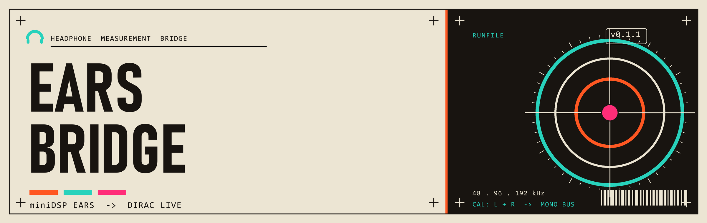
</p>

<p align="center">
  
  
  
  
</p>

A cross-platform desktop app that lets you use a two-channel **miniDSP EARS** or **EARS Pro**
headphone-measurement jig with **Dirac Live**, which only accepts a single calibrated microphone
channel.

Dirac Live expects one microphone with one calibration curve. The EARS has two capsules — one per
ear — each with its own factory calibration file. EARS Bridge sits between the jig and Dirac: it
captures both ear channels, applies each ear's calibration as an inverse-correction FIR, combines the
two into a single mono signal, and presents that mono signal to Dirac through a virtual audio device.
Dirac sees exactly what it expects — one calibrated mic — while both capsules are accounted for.

<p align="center"><b>· INDEX ·</b></p>

<p align="center">
<a href="#how-it-works"><code>01</code> How it works</a> &nbsp;·&nbsp; <a href="#status-and-platform-support"><code>02</code> Status</a> &nbsp;·&nbsp; <a href="#requirements"><code>03</code> Requirements</a> &nbsp;·&nbsp; <a href="#install-windows"><code>04</code> Install / Windows</a> &nbsp;·&nbsp; <a href="#install-macos"><code>05</code> Install / macOS</a> &nbsp;·&nbsp; <a href="#build-from-source-developers"><code>06</code> Build from source</a> &nbsp;·&nbsp; <a href="#usage"><code>07</code> Usage</a> &nbsp;·&nbsp; <a href="#calibration-files"><code>08</code> Calibration files</a> &nbsp;·&nbsp; <a href="#notes-and-tips"><code>09</code> Notes &amp; tips</a> &nbsp;·&nbsp; <a href="#health-indicators"><code>10</code> Health indicators</a> &nbsp;·&nbsp; <a href="#building-and-testing"><code>11</code> Building &amp; testing</a> &nbsp;·&nbsp; <a href="#project-structure"><code>12</code> Project structure</a> &nbsp;·&nbsp; <a href="#bench-validation"><code>13</code> Bench validation</a> &nbsp;·&nbsp; <a href="#license"><code>14</code> License</a> &nbsp;·&nbsp; <a href="#acknowledgements"><code>15</code> Acknowledgements</a>
</p>

<a id="how-it-works"></a>


```
 EARS / EARS Pro            EARS Bridge                         Virtual cable        Dirac Live
 ┌───────────────┐   ┌──────────────────────────────┐   ┌──────────────────┐   ┌──────────────┐
 │ Left  capsule ├──►│ Left  cal FIR  ┐               │   │  VB-CABLE (Win)  │   │  Recording   │
 │ Right capsule ├──►│ Right cal FIR  ├─► combine ──► │──►│  BlackHole (mac) │──►│  device =    │
 └───────────────┘   │                ┘   to mono     │   │                  │   │  the cable   │
   2-ch capture      │  async sample-rate bridge      │   └──────────────────┘   └──────────────┘
                     └──────────────────────────────┘
```

The capture device and the virtual output device run on independent clocks, so the audio path
includes a lock-free, drift-correcting asynchronous sample-rate converter between them. The
correction filters are minimum-phase FIRs derived from each ear's calibration file and rebuilt
off-thread whenever you change a file or the sample rate.

<a id="status-and-platform-support"></a>

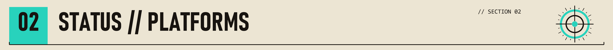

- **Windows** — built and tested with the bundled test suite, and packaged as a one-click installer
  (a self-contained `.exe`, no redistributable required). This is the primary, verified platform.
- **macOS** — builds from the same CMake project and uses CoreAudio (including an optional private
  aggregate device for clock-locked capture and playback), and is packaged as a universal
  (Apple Silicon + Intel) `.dmg`. The build/packaging and the audio path still need validation against
  real Apple hardware; see the bench-validation runbook below. The `.dmg` is not yet code-signed or
  notarized, so first launch needs a one-time Gatekeeper step (below).

<a id="requirements"></a>

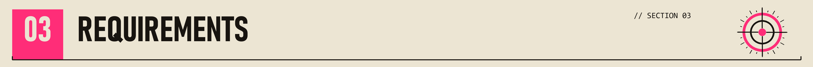

### Hardware
- A **miniDSP EARS** (USB, fixed 48 kHz / 24-bit) **or EARS Pro** (USB-C, 44.1–192 kHz, 16/24/32-bit).
- The per-ear factory calibration files for your unit (FRD text files, one per capsule).

### Software
- **Dirac Live** (the host you are measuring headphones with).
- A **virtual audio device** to carry the mono signal into Dirac:
  - Windows: [VB-CABLE](https://vb-audio.com/Cable/) (or VoiceMeeter).
  - macOS: [BlackHole 2ch](https://existential.audio/blackhole/) (or Loopback).
- On Windows, nothing else — the installer's app is self-contained. (Building from source or for
  macOS needs a C++20 toolchain; see [Build from source](#build-from-source-developers).)

<a id="install-windows"></a>

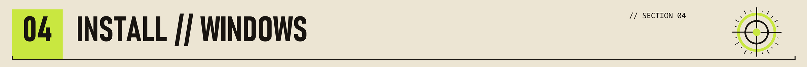

1. **Install the app.** Download the latest `EARS-Bridge-<version>-Setup.exe` from the
   [Releases page](https://github.com/Elevatormusic/ears-bridge/releases) and run it. The wizard
   installs EARS Bridge and adds a Start Menu shortcut; no Visual C++ redistributable or other
   runtime is required (the executable is fully self-contained). It installs per-user, so it does not
   need administrator rights.
2. **Install a virtual audio device.** Install [VB-CABLE](https://vb-audio.com/Cable/) and reboot if
   its installer asks. EARS Bridge sends its mono output to this device; Dirac reads from the
   device's capture side.

That is all that is needed to run the app. The measurement workflow is below under [Usage](#usage).

<a id="install-macos"></a>


1. **Install the app.** Download the latest `EARS-Bridge-<version>-macOS.dmg` from the
   [Releases page](https://github.com/Elevatormusic/ears-bridge/releases), open it, and drag
   **EARS Bridge** into the **Applications** folder. The build is a universal binary (Apple Silicon
   and Intel).
2. **First launch (Gatekeeper).** The app is not yet notarized by Apple, so the first time you open
   it macOS will warn about an unidentified developer. Either right-click the app and choose **Open**
   (then confirm), or clear the quarantine flag once in Terminal:
   ```sh
   xattr -dr com.apple.quarantine "/Applications/EARS Bridge.app"
   ```
3. **Install a virtual audio device.** Install [BlackHole 2ch](https://existential.audio/blackhole/)
   (or Loopback). EARS Bridge sends its mono output to this device; Dirac reads from the device's
   capture side.

The measurement workflow is below under [Usage](#usage).

<a id="build-from-source-developers"></a>


You only need this to modify the app or build for macOS; end users should use the installer above.

**Prerequisites (all platforms):**
- [CMake](https://cmake.org/) 3.22 or newer.
- A C++20 compiler: MSVC (Visual Studio Build Tools) on Windows, or Xcode / Apple Clang on macOS.
- An internet connection for the first configure — [JUCE](https://juce.com/) 8.0.4 and
  [Catch2](https://github.com/catchorg/Catch2) v3.6.0 are fetched automatically by CMake.

**Windows**

This repo includes `tools/dev.cmd`, a wrapper that runs a command inside the MSVC x64 developer
environment with the Visual Studio-bundled Ninja on the path (so you do not need to open a
"Developer Command Prompt" yourself):

```bat
tools\dev.cmd cmake -G Ninja -B build -DCMAKE_BUILD_TYPE=Release
tools\dev.cmd cmake --build build
```

The app is built to `build\EarsBridge_artefacts\Release\EARS Bridge.exe` (statically linked against
the MSVC runtime, so it runs on a clean Windows machine with no redistributable).

**macOS**

```sh
cmake -G Xcode -B build
cmake --build build --config Release
```

This produces `EARS Bridge.app` under `build/EarsBridge_artefacts/Release/`. (A Ninja +
`-DCMAKE_BUILD_TYPE=Release` configuration also works.)

### Building the Windows installer

The installer is an [Inno Setup](https://jrsoftware.org/isinfo.php) wizard. Install Inno Setup once
(`winget install JRSoftware.InnoSetup`), then run:

```bat
tools\build-installer.cmd
```

This builds the Release app and writes `dist\EARS-Bridge-<version>-Setup.exe`. The
[`.github/workflows/release.yml`](.github/workflows/release.yml) workflow does the same on CI:
pushing a tag like `v0.2.0` builds the installer and attaches it to a GitHub Release automatically.
The app icon is generated by [`installer/make_icon.py`](installer/make_icon.py).

### Building the macOS disk image

On a Mac (with CMake and Xcode command-line tools):

```sh
tools/build-installer-mac.sh           # or pass a version: tools/build-installer-mac.sh 0.2.0
```

This builds a universal (arm64 + x86_64) Release app and writes
`dist/EARS-Bridge-<version>-macOS.dmg` (a drag-to-Applications disk image) using `hdiutil`. To
produce a signed build, set `CODESIGN_IDENTITY` to a Developer ID Application identity before running
it. The same CI workflow builds the `.dmg` on a macOS runner and attaches it to the Release.

> The `.dmg` is not notarized. For frictionless distribution you need an Apple Developer account to
> code-sign and notarize the app; until then users clear Gatekeeper once as shown under
> [Install (macOS)](#install-macos).

<a id="usage"></a>

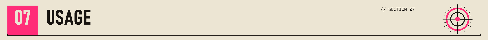

1. **Connect the EARS** and launch **EARS Bridge**.
2. **Select devices:** choose the EARS (or EARS Pro) as the input and your virtual cable as the
   output.
3. **Load calibration files:** drag each ear's calibration file into the matching Left / Right slot.
   Use the **HPN** files by default (see notes below).
4. **Pick a combine mode.** *Average* `(L+R)/2` is the recommended default; the others (Sum, Left,
   Right) are available for special cases.
5. **Set the sample rate and bit depth** to match how you intend to run Dirac. The app exposes only
   the rates and depths your connected model actually supports.
6. **Press Start.** EARS Bridge is now applying both calibrations and streaming mono to the virtual
   cable.
7. **In Dirac Live,** open the recording-device list and select your virtual cable's **capture** side
   (for example, "CABLE Output (VB-Audio Virtual Cable)" or "BlackHole 2ch").
8. **Measure one ear at a time.** Route playback to a single earcup and run the Dirac measurement,
   then repeat for the other ear. Running Dirac twice — once per ear — keeps each side's correction
   independent.

Keep an eye on the health indicators while a measurement runs (see below); a clean capture is the
prerequisite for a trustworthy measurement.

<a id="calibration-files"></a>

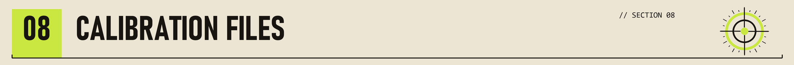

Each EARS capsule ships with its own calibration, distributed as an FRD-format text file (frequency,
magnitude in dB, and optionally phase). miniDSP provides them per serial number. EARS Bridge applies
the **inverse** of the loaded curve so the capsule's known response is removed from the signal Dirac
sees — the same convention REW uses when it subtracts a mic calibration.

**HPN vs HEQ.** miniDSP supplies two variants per capsule:
- **HPN** ("headphone neutral") removes only the capsule's own response. This is the correct choice
  for use with Dirac and is the default.
- **HEQ** additionally bakes in a headphone target curve. If you load HEQ, Dirac would apply a target
  on top of one already in the signal — a double correction. EARS Bridge flags HEQ files so you do
  not select them by accident.

<a id="notes-and-tips"></a>

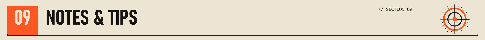

- **Run Dirac once per ear.** Dirac correlates one mic; measuring left and right separately gives each
  earcup its own correction.
- **WASAPI / CoreAudio, not ASIO.** Bridging a capture device to a different render device requires a
  driver model that exposes separate inputs and outputs; ASIO does not, so EARS Bridge uses WASAPI on
  Windows and CoreAudio on macOS. If an ASIO type is selected, the app falls back automatically.
- **Exclusive mode.** Recent Dirac Live versions open the recording device in WASAPI-exclusive mode by
  default. If exclusive open fails for your cable, set both the cable and the app to the same sample
  rate, or use Dirac's documented shared-mode opt-out.
- **Let the filters settle.** The correction filters load on a background thread; give them a moment
  after changing a calibration file or sample rate before starting a sweep.

<a id="health-indicators"></a>

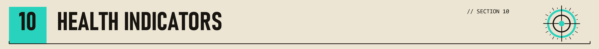

While running, EARS Bridge monitors the capture for conditions that would invalidate a measurement:

- **Clean-capture** latches off if the audio path drops or overruns samples, or if a device reports an
  xrun — i.e. anything that would put gaps in what Dirac records.
- **Dropped frames** counts samples lost to the bridge (capture-side overrun or render-side underrun)
  as a running trend.
- **Capture-to-render ratio** shows the live, drift-corrected resample ratio between the two clocks.
- **Input / output levels and clipping** are metered per channel.

If clean-capture is not green for the duration of a sweep, re-run it.

<a id="building-and-testing"></a>

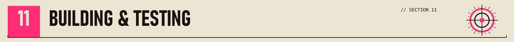

The project builds several targets:

| Target        | What it is                                                        |
|---------------|-------------------------------------------------------------------|
| `EarsBridge`  | The GUI application.                                               |
| `eb_diag`     | A console tool that enumerates audio devices (useful for setup).  |
| `eb_tests`    | The Catch2 unit-test suite.                                        |

Run the tests (Windows shown; drop `tools\dev.cmd` on macOS):

```bat
tools\dev.cmd cmake --build build --target eb_tests
tools\dev.cmd ctest --test-dir build --output-on-failure
```

<a id="project-structure"></a>

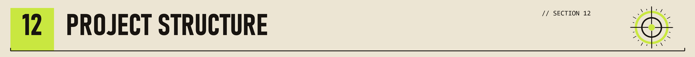

```
src/
  cal/        Calibration-file parsing and FIR design
  audio/      Processing graph, clock bridge, device manager, health, engine facade
  platform/   macOS CoreAudio aggregate device (portable across platforms)
  gui/        Components, theme, level meters, device pickers
  state/      Settings persistence
  Main.cpp    Application entry point
tests/        Catch2 unit tests
docs/         Design spec, implementation plans, and the bench-validation runbook
tools/        Build helpers (dev.cmd, build-installer.cmd, build-installer-mac.sh)
installer/    Inno Setup script, icon, and the icon generator
assets/       README banner and its generator
.github/      CI workflow that builds and publishes the installer
```

<a id="bench-validation"></a>

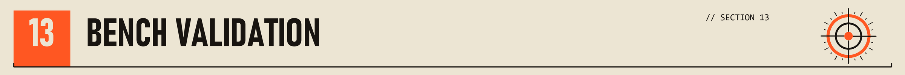

The behaviors that can only be confirmed against real Dirac and real hardware — virtual-cable
visibility, calibration polarity, sample-rate negotiation, inter-clock drift, and the macOS aggregate
path — are written up as manual procedures with explicit pass criteria in
[`docs/bench-validation-runbook.md`](docs/bench-validation-runbook.md).

<a id="license"></a>

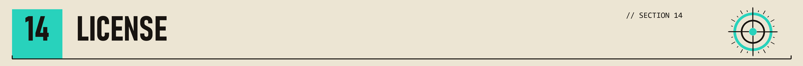

This project does not yet declare a license. Until a `LICENSE` file is added, all rights are reserved
by the repository owner.

<a id="acknowledgements"></a>

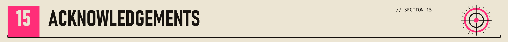

Built with [JUCE](https://juce.com/) and tested with [Catch2](https://github.com/catchorg/Catch2).
For the miniDSP EARS / EARS Pro measurement jigs and Dirac Live room correction.
