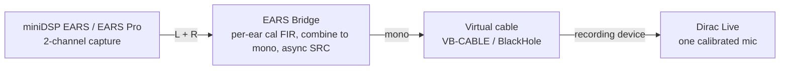

# EARS Bridge


Use a two-channel **miniDSP EARS** or **EARS Pro** headphone-measurement jig with **Dirac Live**, which only accepts a single calibrated microphone. EARS Bridge applies each ear's calibration, combines the two channels to mono, and feeds that mono signal to a virtual audio device that Dirac records from.


[](https://elevatormusic.github.io/ears-bridge/)

**Website and downloads:** [elevatormusic.github.io/ears-bridge](https://elevatormusic.github.io/ears-bridge/)

<p align="center">
  
</p>

Dirac Live expects one microphone with one calibration curve, but the EARS has two capsules, each with its own factory calibration. EARS Bridge sits between the jig and Dirac: it captures both ear channels, applies each ear's calibration as an inverse-correction FIR, combines them into a single mono signal, and presents that to Dirac. Dirac sees exactly what it expects while both capsules are accounted for.

## How it works



The capture device and the virtual output device run on independent clocks, so the path includes a lock-free, drift-correcting asynchronous sample-rate converter. The correction filters are minimum-phase FIRs derived from each ear's calibration file, rebuilt off-thread whenever you change a file or the sample rate.

## Status

- **Windows** — verified: built and tested, packaged as a one-click installer. The executable is self-contained, so no Visual C++ redistributable is needed.
- **macOS** — packaged as a universal (Apple Silicon and Intel) `.dmg`, built by CI. The audio path still needs validation on real Apple hardware (see [Bench validation](#bench-validation)).

Both installers are currently unsigned, so the first launch shows a one-time security prompt — see the install steps below.

## Requirements

### Hardware
- A miniDSP **EARS** (USB, 48 kHz / 24-bit) or **EARS Pro** (USB-C, 44.1–192 kHz, 16/24/32-bit).
- The per-ear factory calibration files for your unit (FRD text files, one per capsule).

### Software
- **Dirac Live**, the software you are measuring headphones with.
- A **virtual audio device** to carry the mono signal into Dirac: [VB-CABLE](https://vb-audio.com/Cable/) on Windows, or [BlackHole 2ch](https://existential.audio/blackhole/) on macOS.

## Install

### Windows
1. Download `EARS-Bridge-<version>-Setup.exe` from the [Releases page](https://github.com/Elevatormusic/ears-bridge/releases) and run it. It installs per-user, so it needs no administrator rights.
2. Install [VB-CABLE](https://vb-audio.com/Cable/) and reboot if its installer asks.

Because the app is unsigned, Windows SmartScreen may warn about an unknown publisher on first launch. Choose **More info**, then **Run anyway**.

### macOS
1. Download `EARS-Bridge-<version>-macOS.dmg` from the [Releases page](https://github.com/Elevatormusic/ears-bridge/releases), open it, and drag **EARS Bridge** to **Applications**.
2. The app is not yet notarized, so clear the quarantine flag once in Terminal (or right-click the app and choose **Open**):
   ```sh
   xattr -dr com.apple.quarantine "/Applications/EARS Bridge.app"
   ```
3. Install [BlackHole 2ch](https://existential.audio/blackhole/).

## Usage

1. Connect the EARS and open EARS Bridge.
2. Select the EARS as the input and your virtual cable as the output.
3. Load each ear's calibration into the matching **Left** and **Right** slot. Use the **HPN** files by default (see [Calibration files](#calibration-files)).
4. Choose a combine mode. **Auto per-ear (Dirac)** is recommended — it records only the earcup Dirac is currently sweeping, so each side stays clean even on open-back headphones where sound leaks across to the other capsule (see [Combine modes](#combine-modes)).
5. Set the sample rate and bit depth, then press **Start**.
6. In Dirac Live, set the recording device to the virtual cable's capture side — for example, "CABLE Output (VB-Audio Virtual Cable)" or "BlackHole 2ch".
7. **Set the level.** Play Dirac's level-check tone and turn your headphone amp up until the **L and R input meters sit in the green target band** — comfortably loud, matched, and not clipping. The exact loudness doesn't matter; *too quiet* is what produces a poor, "tin-can" result (see [Setting the level](#setting-the-level-gain-staging)).
8. Run Dirac's measurement as usual — it is a single routine that sweeps both channels (left, then right); Dirac has no single-earcup mode. With **Auto per-ear**, EARS Bridge follows whichever earcup is sounding and feeds only that ear's mic, so that one routine corrects both ears. (The **Two-pass** modes are the manual alternative: run Dirac's measurement twice, switching EARS Bridge between Left and Right.)

Watch the [health indicators](#health-indicators) while measuring. A clean capture is the prerequisite for a trustworthy result.

## Calibration files

Each EARS capsule ships with its own calibration as an FRD text file. EARS Bridge applies the **inverse** of the loaded curve, removing the capsule's known response from what Dirac sees — the same convention REW uses when it subtracts a mic calibration.

miniDSP supplies two variants per capsule:

- **HPN** removes only the capsule's own response. This is the correct choice with Dirac, and the default.
- **HEQ** also bakes in a headphone target. Loading it would double up with the target Dirac applies, so EARS Bridge flags HEQ files to prevent that.

## Combine modes

EARS Bridge captures both ear channels, but Dirac records one mono signal, so the two ears have to be combined. The mode you choose decides how:

- **Auto per-ear (Dirac)** — *recommended for headphones.* Dirac measures with a single routine that sweeps both channels (left, then right); EARS Bridge tracks which earcup is sounding and feeds only that ear's calibrated mic, so each sweep is a single clean arrival, open-back leakage into the other capsule is never folded in, and that one routine corrects both ears. Just run Dirac's normal measurement.
- **Two-pass Left / Two-pass Right** — locks the feed to one ear. Dirac has no single-earcup mode (its routine always sweeps both channels), so this is the manual alternative to Auto: run Dirac's whole measurement with EARS Bridge on **Left**, then again on **Right** — two Dirac projects, one corrected channel each. Use it for explicit control, or if Auto's earcup detection ever misreads.
- **Average** `(L+R)/2` and **Sum** `L+R` — collapse both ears into one. Auto per-ear is preferred because it captures only the earcup Dirac is sweeping and ignores the other (silent) cup's open-back leakage; Average and Sum fold that leakage in, and **Sum** also adds +6 dB and can clip.

## Setting the level (gain staging)

The most confusing part of measuring headphones is what to set where — amp volume, the EARS gain switch, Dirac's output and microphone levels — and the various guides disagree. The single rule that resolves it:

**The absolute loudness doesn't matter.** Dirac builds the correction from the *relative* difference between what it measures and its target curve, so the filter comes out the same whether you measure quietly or loudly. What *does* matter is a clean capture: enough signal above the noise floor (good SNR), no clipping, and the two ears at a matched level. That is why "find your headphones' reference SPL and set your amp from it" — advice borrowed from speaker/room calibration — does not apply here.

So there is really just one thing to set: **the level the meters show.**

- **Headphone amp volume** — your main level control. Turn it up until the **L and R input meters sit in the green target band**, matched and not clipping. Set it once and leave it for both the left and right sweeps. Too quiet is as bad as too loud: a quiet capture has poor SNR and sounds thin / "tin-can"; a clipped one is worse.
- **EARS gain switch (DIP)** — leave it at the factory default (18 dB on the EARS). It sets the jig's *input headroom*, not loudness. Only step it **down** if the input meter clips even at a sensible amp level — and change it between runs, since it re-enumerates the USB device.
- **Dirac's output / playback level** — keep it healthy, not buried. Together with the amp it drives the meters; *raise* it (don't cut it) if a measurement is too quiet.
- **Dirac's microphone / input gain** — set so Dirac's own recording meter sits in its target window with headroom above the noise floor. It is an SNR trim, not a loudness control; don't crank it to silence a low-signal warning — if the level is already good, the problem is the capture path, not mic gain.
- **EARS Bridge Output trim** (under Advanced) — leave at 0 dB. It can only *attenuate*, so it cannot rescue a too-quiet measurement — that fix is upstream at the amp. Use it only to pull a hot or Sum-mode feed down.
- **Exclusive vs shared mode** is a separate axis entirely — it decides whether devices *connect*, not how loud they are. Leave every device in **shared** mode (see [troubleshooting](#tips-and-troubleshooting)).

EARS Bridge watches this for you: if a run never reaches a healthy level it shows **"level low — turn your amp up to the green band"** instead of a misleading "clean."

## Tips and troubleshooting

- **One Dirac routine covers both ears.** Dirac's measurement is a single routine that sweeps both channels — there is no single-earcup mode to select. Auto per-ear gives each earcup its own correction from that one routine; Two-pass is the manual two-run alternative.
- **Use WASAPI or CoreAudio, not ASIO.** Bridging a capture device to a different render device needs a driver model with separate inputs and outputs; ASIO does not provide one. The app uses WASAPI on Windows and CoreAudio on macOS, and falls back automatically if an ASIO device is selected.
- **If Dirac can't open the cable** (e.g. *"Failed to connect to the microphone … Recording device error", error code 600007*): Dirac Live 3.10.3+ opens the recording device in **WASAPI exclusive mode**, and the standard VB-CABLE exposes no exclusive-mode format for it to use. This is not a sample-rate problem. Fix it on the Dirac/Windows side, easiest first:
  1. **Let EARS Bridge fix it.** When it detects the standard cable it shows a **"Set Dirac to shared mode"** button — click it, then fully quit and relaunch Dirac and reselect the cable's output. It sets Dirac's own `DAUDIO_WASAPI_NON_EXCLUSIVE` = `ON` *User* environment variable (you can also add it by hand via Windows search → "Edit environment variables for your account").
  2. **Or disable exclusive control on the cable.** `mmsys.cpl` → **Recording** → "CABLE Output (VB-Audio Virtual Cable)" → **Properties** → **Advanced** → untick *"Allow applications to take exclusive control of this device."*
  3. **Check microphone privacy.** Settings → Privacy & security → Microphone → turn on *"Let desktop apps access your microphone."*
  4. **Start EARS Bridge first, then open Dirac** so the cable's shared stream is already live.

  **Don't reach for the VB-Audio Hi-Fi Cable to dodge this.** It avoids the 600007 error, but the Hi-Fi Cable has no internal sample-rate converter, so it won't carry EARS Bridge's audio through to Dirac — Dirac connects, but the mic input stays dead. Use the standard **VB-CABLE** with shared mode (above).
- **Let the filters settle.** Correction filters load on a background thread. Wait a moment after changing a calibration file or the sample rate before starting a sweep.

## Health indicators

While running, EARS Bridge watches for conditions that would invalidate a measurement and warns you in the status line instead of letting a bad capture pass quietly:

- **Clean capture** turns off if the path drops or overruns samples, or a device reports an xrun.
- **Dropped frames** counts samples lost at the bridge as a running trend.
- **Capture-to-render ratio** shows the live, drift-corrected resample ratio.
- **Input and output levels** are metered per channel. The L and R input meters carry a green **target band** (−18 to −12 dBFS) to set your amp against. A sustained input clip prompts you to lower the EARS gain switch and/or the Dirac level; output clipping (e.g. the +6 dB Sum mode) is flagged too.
- **Level too low** — a capture that is present but never reaches a healthy level (too quiet for good SNR — the cause of a thin, "tin-can" result) is flagged so it can't pass as "clean"; raise your amp until the meters reach the green band.
- **Device disconnect** — if the EARS or the virtual cable drops out mid-run, the measurement stops with a clear message instead of recording silence as "clean".
- **No input signal** — a connected-but-silent jig (muted, or the wrong input device) is called out rather than reading as clean.
- **Rate / bit-depth downgrade** — if Windows grants a different format than you selected, you're told the run is being resampled.

If clean capture is not green for the whole sweep, run it again.

## Build from source

You only need this to modify the app or build for macOS from source; end users should use the installers above.

**Prerequisites:** CMake 3.22 or newer, a C++20 compiler (MSVC on Windows, Xcode or Apple Clang on macOS), and an internet connection for the first configure — JUCE 8.0.4 and Catch2 v3.6.0 are fetched automatically.

**Windows.** `tools\dev.cmd` runs a command inside the MSVC environment with Ninja on the path:

```bat
tools\dev.cmd cmake -G Ninja -B build -DCMAKE_BUILD_TYPE=Release
tools\dev.cmd cmake --build build
```

The app builds to `build\EarsBridge_artefacts\Release\EARS Bridge.exe`, statically linked so it runs without a redistributable.

**macOS.**

```sh
cmake -G Xcode -B build
cmake --build build --config Release
```

Run the tests:

```bat
tools\dev.cmd cmake --build build --target eb_tests
tools\dev.cmd ctest --test-dir build --output-on-failure
```

<details>
<summary>Building the installers</summary>

**Windows** (needs [Inno Setup](https://jrsoftware.org/isinfo.php) — `winget install JRSoftware.InnoSetup`):

```bat
tools\build-installer.cmd
```

writes `dist\EARS-Bridge-<version>-Setup.exe`.

**macOS** (on a Mac with Xcode command-line tools):

```sh
tools/build-installer-mac.sh
```

writes a universal `dist/EARS-Bridge-<version>-macOS.dmg`. Set `CODESIGN_IDENTITY` to a Developer ID Application identity to sign it.

The `.github/workflows/release.yml` workflow builds and publishes both installers on a `v*` tag.
</details>

<details>
<summary>Project structure</summary>

```
src/cal/        Calibration-file parsing and FIR design
src/audio/      Processing graph, clock bridge, device manager, health, engine
src/platform/   macOS CoreAudio aggregate device
src/gui/        Components, theme, meters, device pickers
src/state/      Settings persistence
tests/          Catch2 unit tests
docs/           Design spec, implementation plans, bench-validation runbook
tools/          Build and packaging helpers
installer/      Inno Setup script and the app icon
```
</details>

## Bench validation

The behaviors that can only be confirmed against real Dirac and hardware — virtual-cable visibility, calibration polarity, sample-rate negotiation, inter-clock drift, and the macOS aggregate path — are documented as manual procedures with explicit pass criteria in [`docs/bench-validation-runbook.md`](docs/bench-validation-runbook.md).

## License

No license has been declared yet. Until a `LICENSE` file is added, all rights are reserved by the repository owner.

## Acknowledgements

Built with [JUCE](https://juce.com/) and tested with [Catch2](https://github.com/catchorg/Catch2), for the miniDSP EARS and EARS Pro measurement jigs and Dirac Live.
