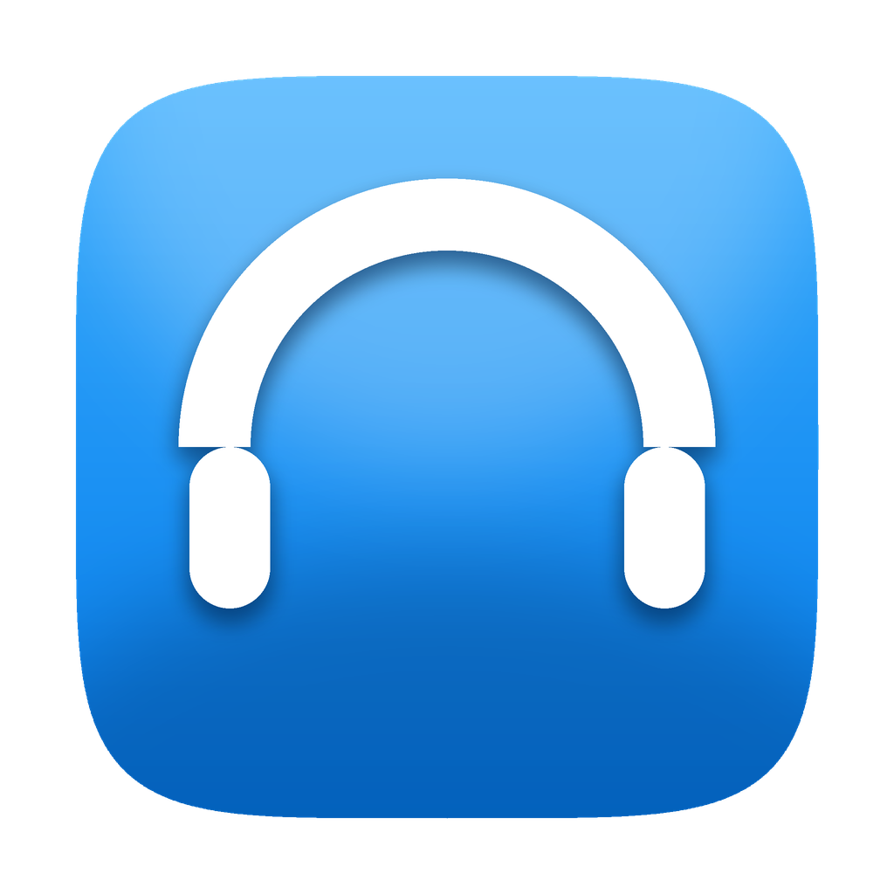
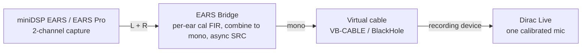

# EARS Bridge



Use a two-channel **miniDSP EARS** or **EARS Pro** headphone-measurement jig with **Dirac Live**, which only accepts a single calibrated microphone. EARS Bridge applies each ear's calibration, combines the two channels to mono, and feeds that mono signal to a virtual audio device that Dirac records from.


[](https://elevatormusic.github.io/ears-bridge/)

**Website and downloads:** [elevatormusic.github.io/ears-bridge](https://elevatormusic.github.io/ears-bridge/)

Dirac Live expects one microphone with one calibration curve, but the EARS has two capsules, each with its own factory calibration. EARS Bridge sits between the jig and Dirac: it captures both ear channels, applies each ear's calibration as an inverse-correction FIR, combines them into a single mono signal, and presents that to Dirac. Dirac sees exactly what it expects while both capsules are accounted for.

## How it works



The capture device and the virtual output device run on independent clocks, so the path includes a lock-free, drift-correcting asynchronous sample-rate converter. The correction filters are minimum-phase FIRs derived from each ear's calibration file, rebuilt off-thread whenever you change a file or the sample rate.

## Status

- **Windows** — verified: built and tested, packaged as a one-click installer. The executable is self-contained, so no Visual C++ redistributable is needed.
- **macOS** — packaged as a universal (Apple Silicon and Intel) `.dmg`, built by CI. The audio path still needs validation on real Apple hardware (see [Bench validation](#bench-validation)).

Both installers are currently unsigned, so the first launch shows a one-time security prompt — see the install steps below.

## Requirements

### Hardware
- A miniDSP **EARS** (USB, 48 kHz / 24-bit) or **EARS Pro** (USB-C, 44.1–192 kHz, 16/24/32-bit).
- The per-ear factory calibration files for your unit (FRD text files, one per capsule).

### Software
- **Dirac Live**, the software you are measuring headphones with.
- A **virtual audio device** to carry the mono signal into Dirac: [VB-CABLE](https://vb-audio.com/Cable/) on Windows, or [BlackHole 2ch](https://existential.audio/blackhole/) on macOS.

## Install

### Windows
1. Download `EARS-Bridge-<version>-Setup.exe` from the [Releases page](https://github.com/Elevatormusic/ears-bridge/releases) and run it. It installs per-user, so it needs no administrator rights.
2. Install [VB-CABLE](https://vb-audio.com/Cable/) and reboot if its installer asks.

Because the app is unsigned, Windows SmartScreen may warn about an unknown publisher on first launch. Choose **More info**, then **Run anyway**.

### macOS
1. Download `EARS-Bridge-<version>-macOS.dmg` from the [Releases page](https://github.com/Elevatormusic/ears-bridge/releases), open it, and drag **EARS Bridge** to **Applications**.
2. The app is not yet notarized, so clear the quarantine flag once in Terminal (or right-click the app and choose **Open**):
   ```sh
   xattr -dr com.apple.quarantine "/Applications/EARS Bridge.app"
   ```
3. Install [BlackHole 2ch](https://existential.audio/blackhole/).

## Usage

1. Connect the EARS and open EARS Bridge.
2. Select the EARS as the input and your virtual cable as the output.
3. Load each ear's calibration into the matching **Left** and **Right** slot. Use the **HPN** files by default (see [Calibration files](#calibration-files)).
4. Choose a combine mode. **Average** `(L+R)/2` is recommended.
5. Set the sample rate and bit depth, then press **Start**.
6. In Dirac Live, set the recording device to the virtual cable's capture side — for example, "CABLE Output (VB-Audio Virtual Cable)" or "BlackHole 2ch".
7. Measure one ear at a time: route playback to a single earcup, run the Dirac measurement, then repeat for the other ear.

Watch the [health indicators](#health-indicators) while measuring. A clean capture is the prerequisite for a trustworthy result.

## Calibration files

Each EARS capsule ships with its own calibration as an FRD text file. EARS Bridge applies the **inverse** of the loaded curve, removing the capsule's known response from what Dirac sees — the same convention REW uses when it subtracts a mic calibration.

miniDSP supplies two variants per capsule:

- **HPN** removes only the capsule's own response. This is the correct choice with Dirac, and the default.
- **HEQ** also bakes in a headphone target. Loading it would double up with the target Dirac applies, so EARS Bridge flags HEQ files to prevent that.

## Tips and troubleshooting

- **Measure one ear at a time.** Dirac correlates a single microphone, so measuring left and right separately gives each earcup its own correction.
- **Use WASAPI or CoreAudio, not ASIO.** Bridging a capture device to a different render device needs a driver model with separate inputs and outputs; ASIO does not provide one. The app uses WASAPI on Windows and CoreAudio on macOS, and falls back automatically if an ASIO device is selected.
- **If Dirac fails to open the cable**, it is probably opening the device in WASAPI-exclusive mode at a different rate. Set the cable and the app to the same sample rate, or use Dirac's shared-mode option.
- **Let the filters settle.** Correction filters load on a background thread. Wait a moment after changing a calibration file or the sample rate before starting a sweep.

## Health indicators

While running, EARS Bridge monitors the capture for conditions that would invalidate a measurement:

- **Clean capture** turns off if the path drops or overruns samples, or a device reports an xrun.
- **Dropped frames** counts samples lost at the bridge as a running trend.
- **Capture-to-render ratio** shows the live, drift-corrected resample ratio.
- **Input and output levels** are metered per channel, with clipping indicators.

If clean capture is not green for the whole sweep, run it again.

## Build from source

You only need this to modify the app or build for macOS from source; end users should use the installers above.

**Prerequisites:** CMake 3.22 or newer, a C++20 compiler (MSVC on Windows, Xcode or Apple Clang on macOS), and an internet connection for the first configure — JUCE 8.0.4 and Catch2 v3.6.0 are fetched automatically.

**Windows.** `tools\dev.cmd` runs a command inside the MSVC environment with Ninja on the path:

```bat
tools\dev.cmd cmake -G Ninja -B build -DCMAKE_BUILD_TYPE=Release
tools\dev.cmd cmake --build build
```

The app builds to `build\EarsBridge_artefacts\Release\EARS Bridge.exe`, statically linked so it runs without a redistributable.

**macOS.**

```sh
cmake -G Xcode -B build
cmake --build build --config Release
```

Run the tests:

```bat
tools\dev.cmd cmake --build build --target eb_tests
tools\dev.cmd ctest --test-dir build --output-on-failure
```

<details>
<summary>Building the installers</summary>

**Windows** (needs [Inno Setup](https://jrsoftware.org/isinfo.php) — `winget install JRSoftware.InnoSetup`):

```bat
tools\build-installer.cmd
```

writes `dist\EARS-Bridge-<version>-Setup.exe`.

**macOS** (on a Mac with Xcode command-line tools):

```sh
tools/build-installer-mac.sh
```

writes a universal `dist/EARS-Bridge-<version>-macOS.dmg`. Set `CODESIGN_IDENTITY` to a Developer ID Application identity to sign it.

The `.github/workflows/release.yml` workflow builds and publishes both installers on a `v*` tag.
</details>

<details>
<summary>Project structure</summary>

```
src/cal/        Calibration-file parsing and FIR design
src/audio/      Processing graph, clock bridge, device manager, health, engine
src/platform/   macOS CoreAudio aggregate device
src/gui/        Components, theme, meters, device pickers
src/state/      Settings persistence
tests/          Catch2 unit tests
docs/           Design spec, implementation plans, bench-validation runbook
tools/          Build and packaging helpers
installer/      Inno Setup script and the app icon
```
</details>

## Bench validation

The behaviors that can only be confirmed against real Dirac and hardware — virtual-cable visibility, calibration polarity, sample-rate negotiation, inter-clock drift, and the macOS aggregate path — are documented as manual procedures with explicit pass criteria in [`docs/bench-validation-runbook.md`](docs/bench-validation-runbook.md).

## License

No license has been declared yet. Until a `LICENSE` file is added, all rights are reserved by the repository owner.

## Acknowledgements

Built with [JUCE](https://juce.com/) and tested with [Catch2](https://github.com/catchorg/Catch2), for the miniDSP EARS and EARS Pro measurement jigs and Dirac Live.
